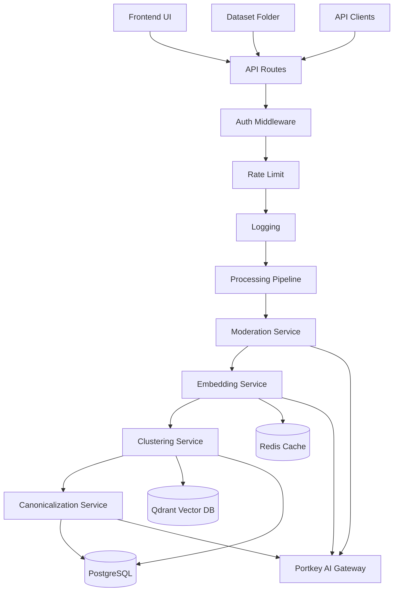
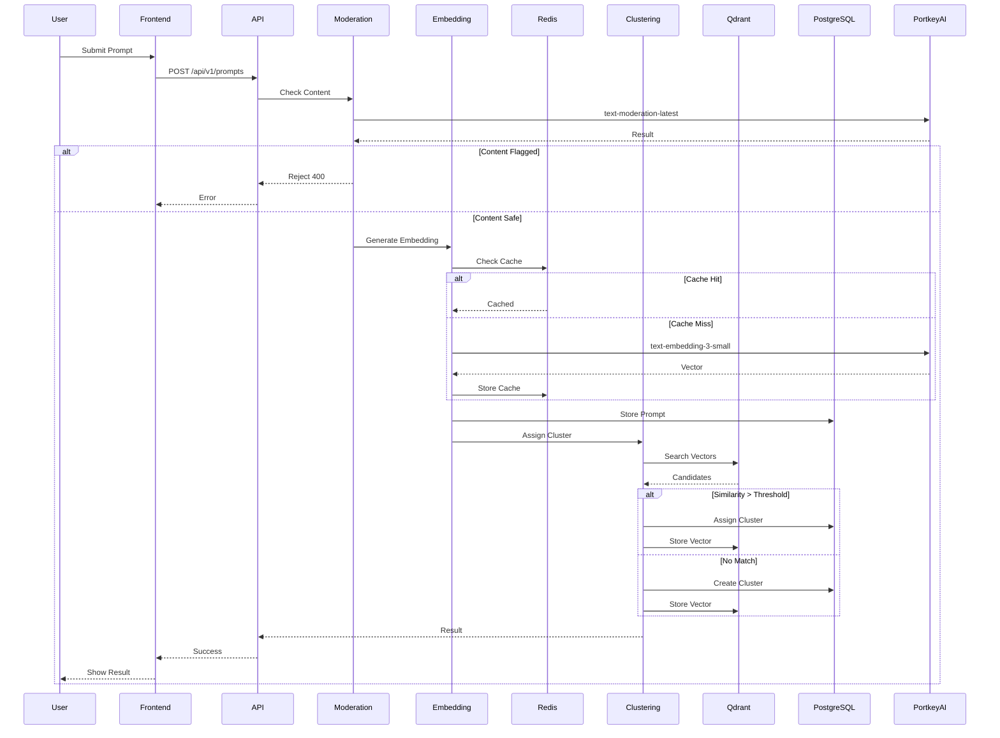
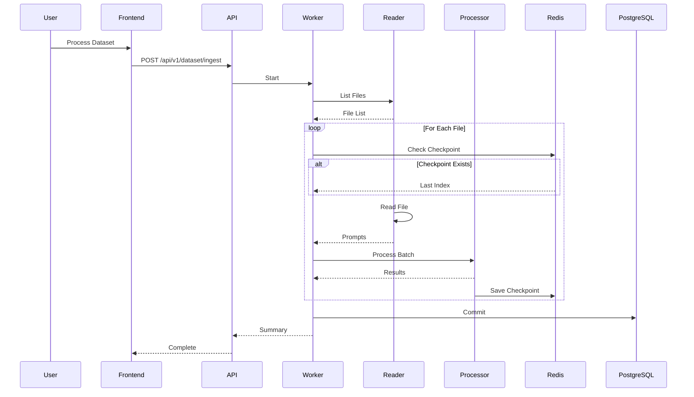
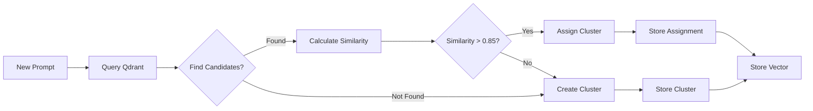
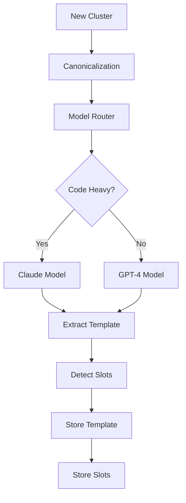
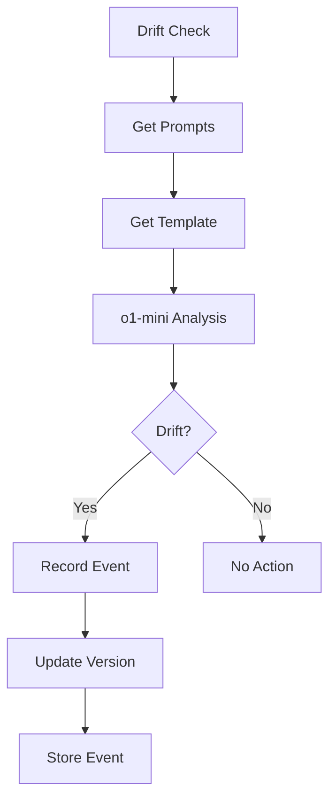
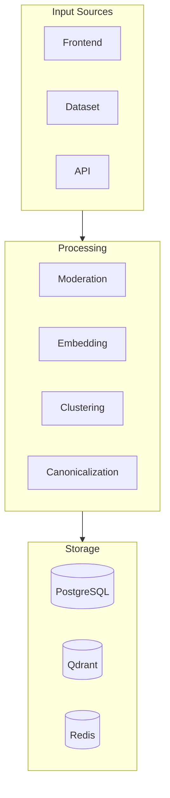
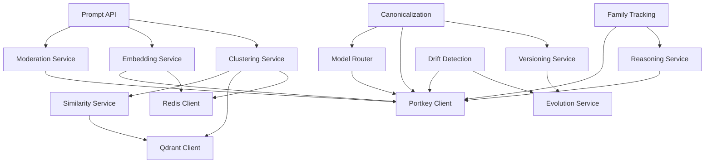
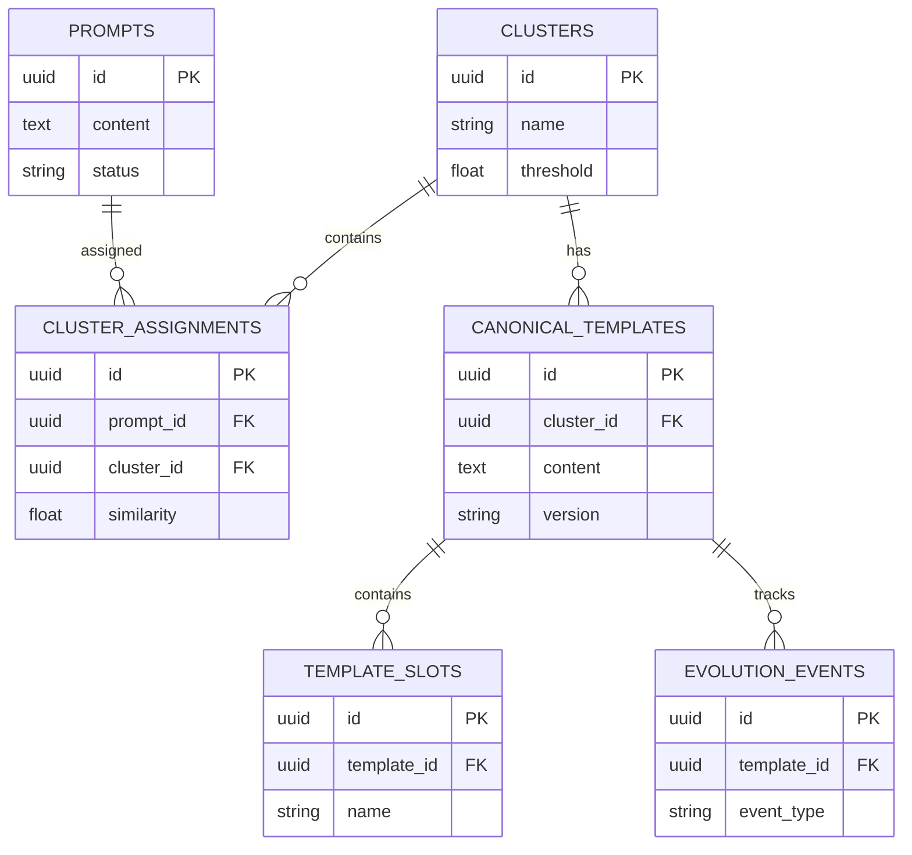

# Smart Prompt Parser & Canonicalisation Engine - System Architecture

## System Flow Diagram

## Detailed Component Flow

### 1. Prompt Ingestion Flow

### 2. Dataset Processing Flow

### 3. Clustering Flow

### 4. Template Extraction Flow

### 5. Evolution Flow

### 6. Data Flow

## Service Dependencies

## Database Schema

## AI Model Usage

| Service | Primary Model | Fallback Model | Use Case |
|---------|--------------|----------------|----------|
| Moderation | text-moderation-latest | - | Content safety |
| Embedding | text-embedding-3-small | text-embedding-3-large | Vector generation |
| Canonicalization | gpt-4o | claude-3-5-sonnet | Template extraction |
| Drift Detection | o1-mini | - | Semantic drift |
| Family Tracking | o1-mini | - | Split/merge decisions |
| Reasoning | o1-mini | - | Edge cases |

## Key Design Patterns

1. **Incremental Processing**: Checkpoints in Redis allow resuming dataset processing
2. **Caching Strategy**: Embeddings cached in Redis (7 days), similarity scores cached (1 day)
3. **Model Routing**: Dynamic model selection based on content type (code vs. general)
4. **Semantic Versioning**: Templates versioned using semver (major.minor.patch)
5. **Event-Driven Evolution**: Evolution events trigger template version updates
6. **Confidence Scoring**: All assignments include confidence scores for explainability

