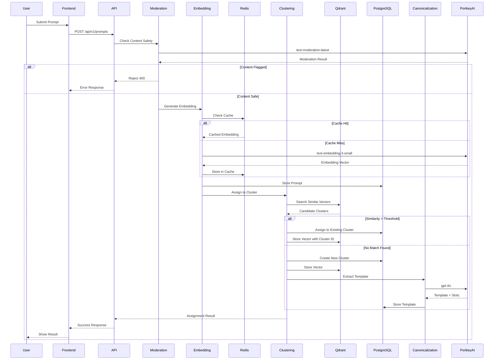
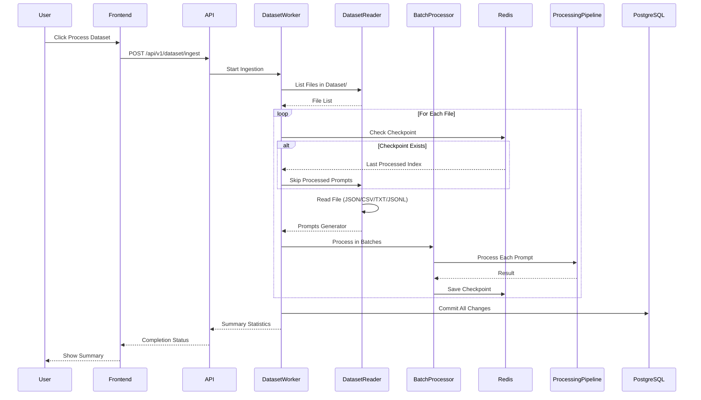
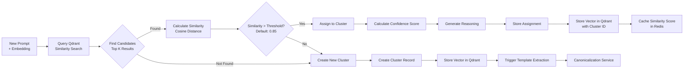
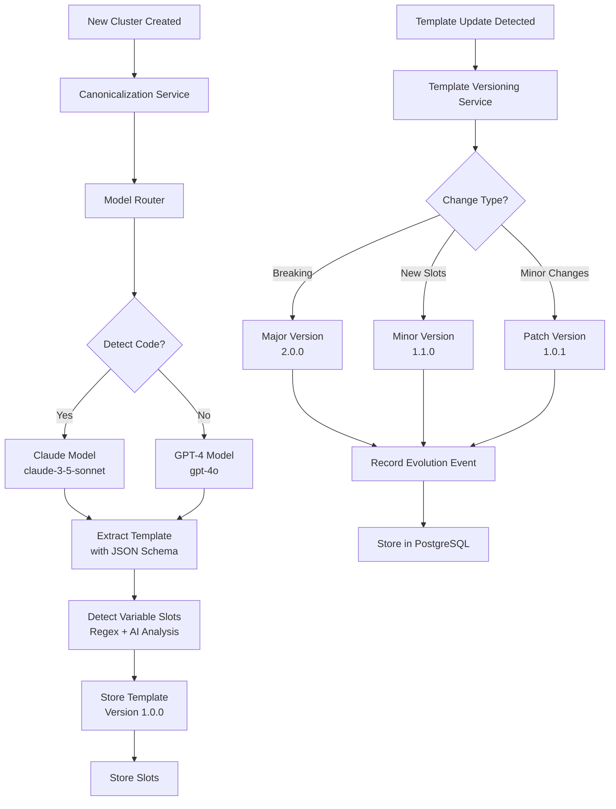
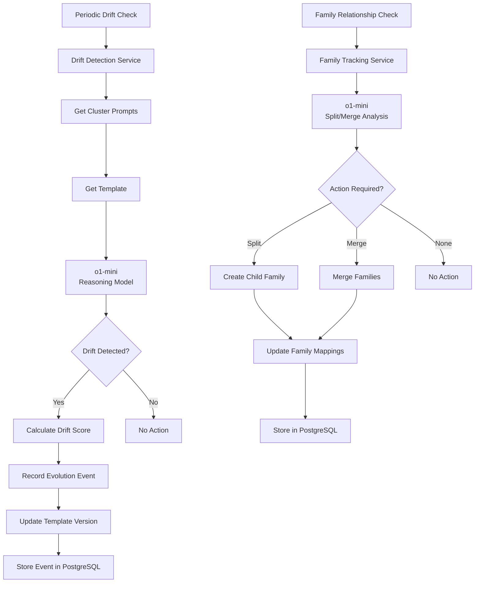
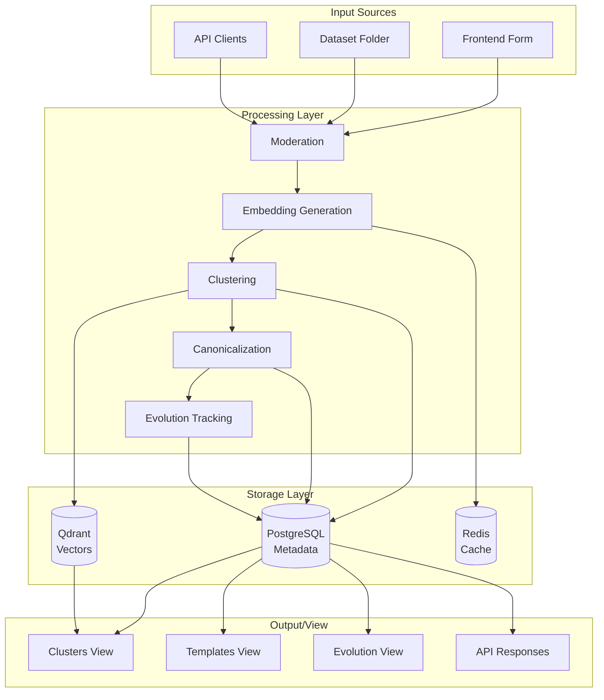
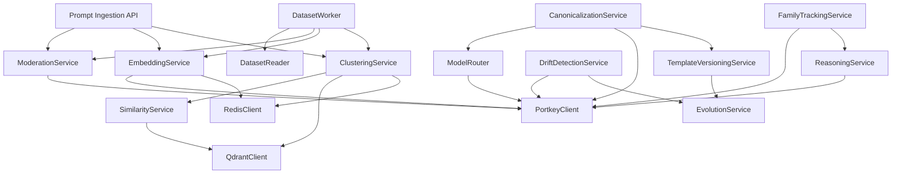
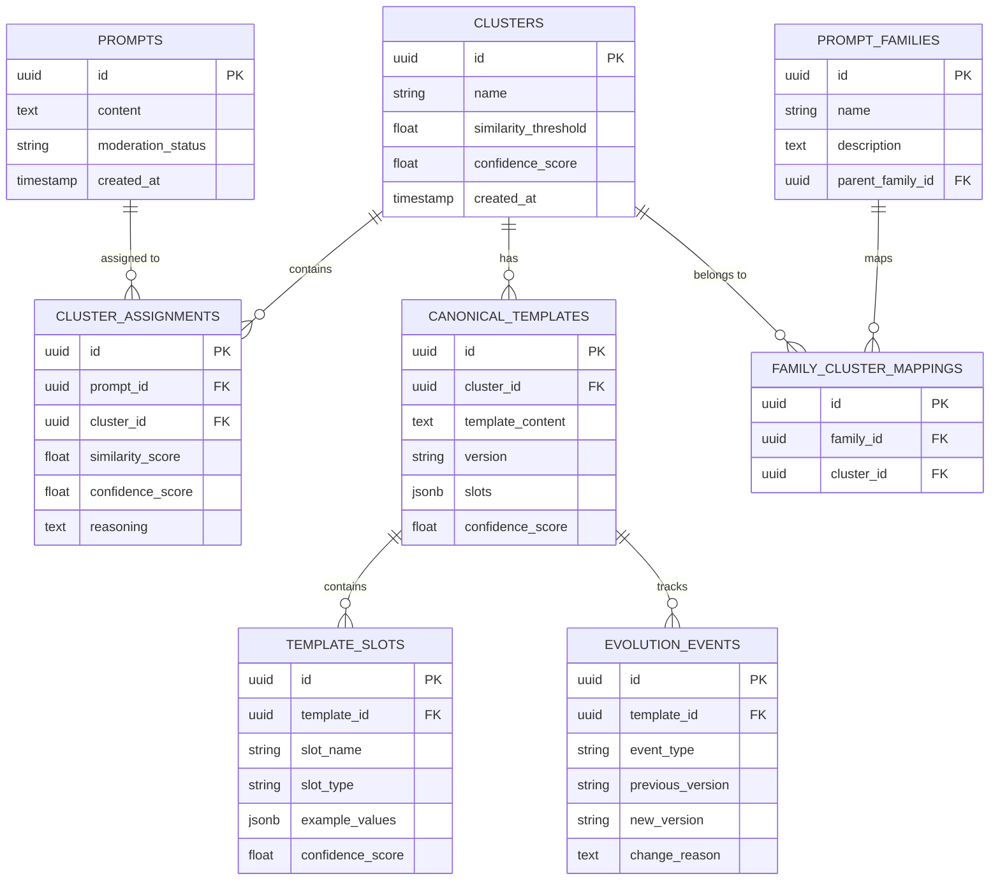

# Smart Prompt Parser & Canonicalisation Engine - System Architecture

## System Flow Diagram

```mermaid
flowchart TB
    %% Entry Points
    Frontend[Frontend UI<br/>Jinja2 Templates]
    DatasetFolder[Dataset Folder<br/>JSON/CSV/TXT/JSONL Files]
    API[API Clients<br/>External Services]
    
    %% API Layer
    subgraph API_Layer["API Layer (FastAPI)"]
        AuthMiddleware[Authentication Middleware<br/>API Key Validation]
        RateLimitMiddleware[Rate Limiting Middleware<br/>Redis-based]
        LoggingMiddleware[Request Logging Middleware<br/>Structured Logs]
        
        WebRoutes[Web Routes<br/>/clusters, /templates, /evolution]
        APIRoutes[API Routes<br/>/api/v1/prompts, /api/v1/clusters]
    end
    
    %% Processing Pipeline
    subgraph Processing["Processing Pipeline"]
        Moderation["Moderation Service<br/>text-moderation-latest"]
        Embedding["Embedding Service<br/>text-embedding-3-small<br/>Fallback: text-embedding-3-large"]
        Clustering["Clustering Service<br/>Semantic Similarity Matching"]
        Canonicalization["Canonicalization Service<br/>gpt-4o<br/>Fallback: claude-3-5-sonnet"]
        TemplateVersioning["Template Versioning Service<br/>Semantic Versioning"]
        EvolutionTracking["Evolution Tracking Service<br/>Event Recording"]
        DriftDetection["Drift Detection Service<br/>o1-mini"]
        FamilyTracking["Family Tracking Service<br/>o1-mini<br/>Split/Merge Logic"]
        Reasoning["Reasoning Service<br/>o1-mini<br/>Edge Case Classification"]
    end
    
    %% Data Storage
    subgraph Storage["Data Storage Layer"]
        PostgreSQL[(PostgreSQL<br/>Structured Data<br/>Prompts, Clusters, Templates)]
        Qdrant[(Qdrant<br/>Vector Database<br/>Embeddings & Similarity Search)]
        Redis[(Redis<br/>Cache Layer<br/>Embeddings, Similarity Scores)]
    end
    
    %% External Services
    subgraph External["External Services"]
        PortkeyAI[Portkey AI Gateway<br/>Model Orchestration<br/>Retry Logic, Virtual Keys]
        CloudWatch[CloudWatch<br/>Logging & Monitoring]
        Prometheus[Prometheus<br/>Metrics Collection]
    end
    
    %% Entry Flow
    Frontend -->|Submit Prompt| APIRoutes
    Frontend -->|View Results| WebRoutes
    DatasetFolder -->|Batch Processing| APIRoutes
    API -->|REST API Calls| APIRoutes
    
    %% Middleware Flow
    APIRoutes --> AuthMiddleware
    AuthMiddleware --> RateLimitMiddleware
    RateLimitMiddleware --> LoggingMiddleware
    LoggingMiddleware --> Processing
    
    %% Processing Flow - Single Prompt
    Processing -->|Step 1: Content Check| Moderation
    Moderation -->|Flagged?| Reject[Reject Prompt<br/>Return Error]
    Moderation -->|Pass| Embedding
    
    Embedding -->|Check Cache| Redis
    Redis -->|Cache Hit| UseCache[Use Cached Embedding]
    Redis -->|Cache Miss| PortkeyAI
    PortkeyAI -->|Generate Embedding| Embedding
    Embedding -->|Store in Cache| Redis
    Embedding -->|Store Prompt| PostgreSQL
    
    Embedding -->|Step 2: Find Similar| Clustering
    Clustering -->|Query Vectors| Qdrant
    Qdrant -->|Similarity Search| Clustering
    Clustering -->|Check Cache| Redis
    Clustering -->|Calculate Similarity| SimilarityService[Similarity Service<br/>Cosine Similarity]
    
    Clustering -->|Match Found?| Decision{Similarity > Threshold?}
    Decision -->|Yes| AssignCluster[Assign to Existing Cluster]
    Decision -->|No| CreateCluster[Create New Cluster]
    
    AssignCluster -->|Store Assignment| PostgreSQL
    CreateCluster -->|Store Cluster| PostgreSQL
    AssignCluster -->|Store Vector| Qdrant
    CreateCluster -->|Store Vector| Qdrant
    
    %% Template Extraction Flow
    CreateCluster -->|New Cluster?| Canonicalization
    AssignCluster -->|On Demand| Canonicalization
    
    Canonicalization -->|Route Model| ModelRouter["Model Router<br/>Code Detection"]
    ModelRouter -->|Code Heavy| ClaudeModel["Claude Model<br/>claude-3-5-sonnet"]
    ModelRouter -->|General| GPT4Model["GPT-4 Model<br/>gpt-4o"]
    
    ClaudeModel -->|Extract Template| Canonicalization
    GPT4Model -->|Extract Template| Canonicalization
    
    Canonicalization -->|Detect Slots| SlotDetection[Slot Detection<br/>Regex + AI Analysis]
    Canonicalization -->|Store Template| PostgreSQL
    SlotDetection -->|Store Slots| PostgreSQL
    
    %% Versioning Flow
    Canonicalization -->|Create Version| TemplateVersioning
    TemplateVersioning -->|Detect Changes| ChangeDetection{Change Type?}
    ChangeDetection -->|Major| MajorVersion[Major Version<br/>Breaking Changes]
    ChangeDetection -->|Minor| MinorVersion[Minor Version<br/>New Slots]
    ChangeDetection -->|Patch| PatchVersion[Patch Version<br/>Minor Updates]
    
    MajorVersion -->|Record Event| EvolutionTracking
    MinorVersion -->|Record Event| EvolutionTracking
    PatchVersion -->|Record Event| EvolutionTracking
    
    %% Evolution & Drift Detection
    EvolutionTracking -->|Store Event| PostgreSQL
    EvolutionTracking -->|Trigger Analysis| DriftDetection
    
    DriftDetection -->|Analyze Cluster| Qdrant
    Qdrant -->|Get Recent Prompts| DriftDetection
    DriftDetection -->|Reasoning Model| PortkeyAI
    PortkeyAI -->|Drift Analysis| DriftDetection
    DriftDetection -->|Record Drift Event| EvolutionTracking
    
    %% Family Tracking
    Clustering -->|Map to Family| FamilyTracking
    FamilyTracking -->|Check Relationships| PostgreSQL
    FamilyTracking -->|Split/Merge Decision| Reasoning
    Reasoning -->|Complex Analysis| PortkeyAI
    PortkeyAI -->|Reasoning Result| FamilyTracking
    FamilyTracking -->|Update Family| PostgreSQL
    
    %% Dataset Processing Flow
    subgraph DatasetProcessing["Dataset Processing Pipeline"]
        DatasetReader[Dataset Reader<br/>Read Files: JSON/CSV/TXT/JSONL]
        BatchProcessor[Batch Processor<br/>Chunk Processing]
        Checkpointing[Checkpointing<br/>Redis-based<br/>Resume on Failure]
    end
    
    DatasetFolder -->|Read Files| DatasetReader
    DatasetReader -->|Extract Prompts| BatchProcessor
    BatchProcessor -->|Process in Batches| Processing
    BatchProcessor -->|Save Checkpoint| Redis
    BatchProcessor -->|Resume from Checkpoint| Checkpointing
    
    %% View Endpoints Flow
    WebRoutes -->|Query Data| PostgreSQL
    WebRoutes -->|Query Vectors| Qdrant
    PostgreSQL -->|Return Results| WebRoutes
    Qdrant -->|Return Vectors| WebRoutes
    WebRoutes -->|Render Templates| Frontend
    
    %% Observability
    LoggingMiddleware -->|Structured Logs| CloudWatch
    Processing -->|Metrics| Prometheus
    Prometheus -->|Metrics Endpoint| API_Layer
    
    %% Styling
    classDef entryPoint fill:#e1f5ff,stroke:#01579b,stroke-width:2px
    classDef apiLayer fill:#f3e5f5,stroke:#4a148c,stroke-width:2px
    classDef processing fill:#e8f5e9,stroke:#1b5e20,stroke-width:2px
    classDef storage fill:#fff3e0,stroke:#e65100,stroke-width:2px
    classDef external fill:#fce4ec,stroke:#880e4f,stroke-width:2px
    
    class Frontend,DatasetFolder,API entryPoint
    class AuthMiddleware,RateLimitMiddleware,LoggingMiddleware,WebRoutes,APIRoutes apiLayer
    class Moderation,Embedding,Clustering,Canonicalization,TemplateVersioning,EvolutionTracking,DriftDetection,FamilyTracking,Reasoning processing
    class PostgreSQL,Qdrant,Redis storage
    class PortkeyAI,CloudWatch,Prometheus external
```

## Detailed Component Flow

### 1. Prompt Ingestion Flow (Single Prompt)

### 2. Dataset Processing Flow

### 3. Clustering & Similarity Flow

### 4. Template Extraction & Versioning Flow

### 5. Evolution & Drift Detection Flow

### 6. Data Flow Architecture

## Component Interactions

### Service Dependencies

## Database Schema Relationships

## AI Model Usage Matrix

| Service | Primary Model | Fallback Model | Use Case |
|---------|--------------|----------------|----------|
| Moderation | @openai/text-moderation-latest | - | Content safety check |
| Embedding | @openai/text-embedding-3-small | @openai/text-embedding-3-large | Vector generation |
| Canonicalization | @openai/gpt-4o | @anthropic/claude-3-5-sonnet | Template extraction |
| Drift Detection | @openai/o1-mini | - | Semantic drift analysis |
| Family Tracking | @openai/o1-mini | - | Split/merge decisions |
| Reasoning | @openai/o1-mini | - | Edge case classification |

## Key Design Patterns

1. **Incremental Processing**: Checkpoints in Redis allow resuming dataset processing
2. **Caching Strategy**: Embeddings cached in Redis (7 days), similarity scores cached (1 day)
3. **Model Routing**: Dynamic model selection based on content type (code vs. general)
4. **Semantic Versioning**: Templates versioned using semver (major.minor.patch)
5. **Event-Driven Evolution**: Evolution events trigger template version updates
6. **Confidence Scoring**: All assignments include confidence scores for explainability

