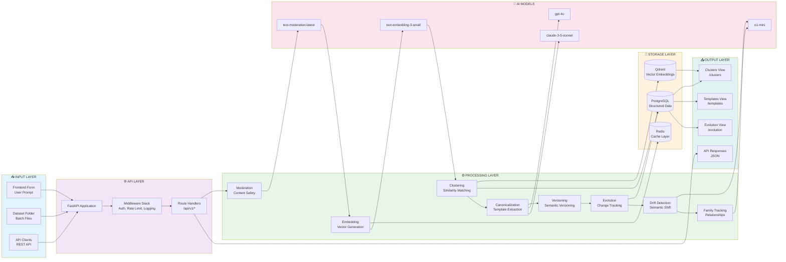
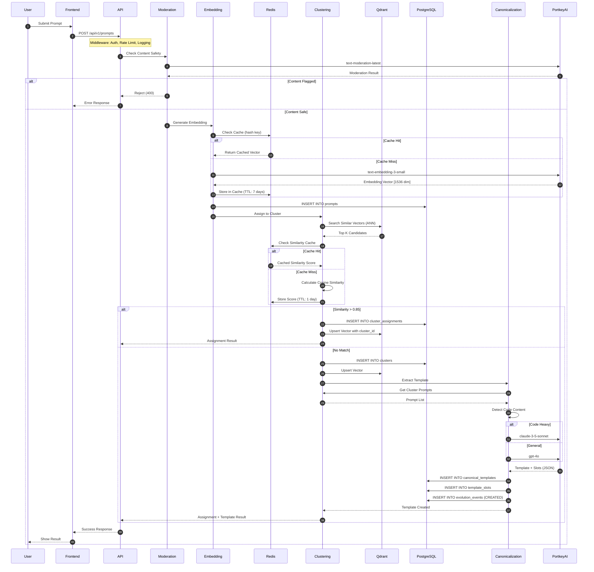
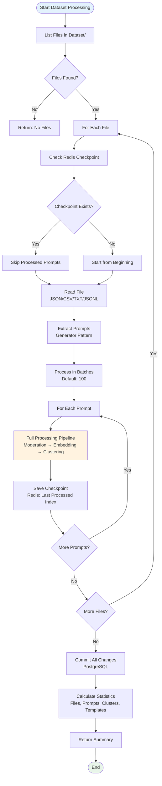
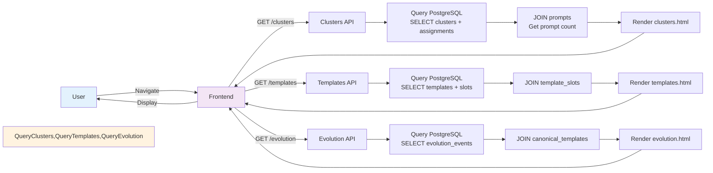
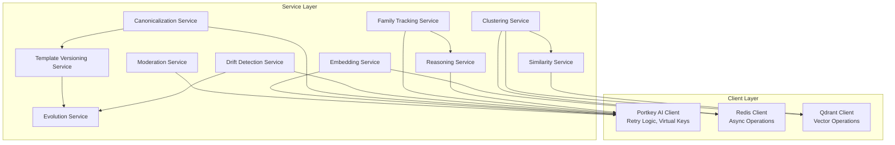
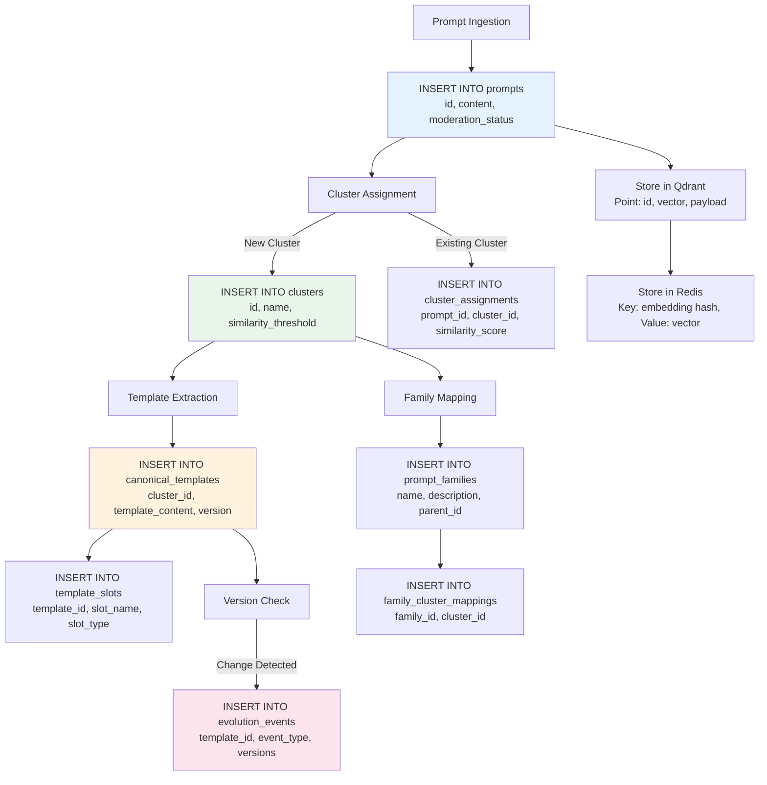

# Smart Prompt Parser & Canonicalisation Engine - Complete System Flow

## Main System Flowchart

```mermaid
flowchart TB
    %% Entry Points
    Start([System Start]) --> Entry{Entry Point}
    Entry -->|User Input| Frontend[Frontend UI<br/>Submit Prompt Form]
    Entry -->|Batch Processing| Dataset[Dataset Folder<br/>Read Files]
    Entry -->|API Call| ExternalAPI[External API Client]
    
    %% Frontend Flow
    Frontend -->|POST /api/v1/prompts| APIGateway[API Gateway<br/>FastAPI]
    Dataset -->|POST /api/v1/dataset/ingest| APIGateway
    ExternalAPI -->|REST API| APIGateway
    
    %% Middleware Stack
    APIGateway --> Auth[Authentication Middleware<br/>API Key Check]
    Auth -->|Skip for Web| RateLimit[Rate Limiting<br/>Redis-based]
    Auth -->|Require Key| RateLimit
    RateLimit --> Logging[Request Logging<br/>Structured Logs]
    Logging --> Pipeline[Processing Pipeline]
    
    %% Pipeline Step 1: Moderation
    Pipeline --> Moderation[1. Moderation Service]
    Moderation -->|Call| PortkeyMod["Portkey AI<br/>text-moderation-latest"]
    PortkeyMod -->|Result| ModCheck{Content Safe?}
    ModCheck -->|Flagged| Reject[Reject Prompt<br/>Return 400 Error]
    ModCheck -->|Safe| EmbeddingStep[2. Embedding Service]
    
    %% Pipeline Step 2: Embedding
    EmbeddingStep --> EmbedCache{Check Redis Cache}
    EmbedCache -->|Hit| UseCached[Use Cached Embedding]
    EmbedCache -->|Miss| GenerateEmbed[Generate Embedding]
    GenerateEmbed -->|Call| PortkeyEmbed["Portkey AI<br/>text-embedding-3-small<br/>Fallback: text-embedding-3-large"]
    PortkeyEmbed -->|Vector| StoreEmbedCache[Store in Redis Cache<br/>TTL: 7 days]
    StoreEmbedCache --> StorePrompt[Store Prompt in PostgreSQL]
    UseCached --> StorePrompt
    
    %% Pipeline Step 3: Clustering
    StorePrompt --> ClusteringStep[3. Clustering Service]
    ClusteringStep --> SimilaritySearch[Similarity Search Service]
    SimilaritySearch -->|Query| QdrantDB[(Qdrant Vector DB<br/>ANN Search)]
    QdrantDB -->|Top K Results| CalcSimilarity[Calculate Cosine Similarity]
    CalcSimilarity --> SimilarityCache{Check Redis Cache}
    SimilarityCache -->|Hit| UseCachedSim[Use Cached Score]
    SimilarityCache -->|Miss| UseCalcSim[Use Calculated Score]
    UseCachedSim --> ClusterDecision{Similarity > Threshold?<br/>Default: 0.85}
    UseCalcSim --> ClusterDecision
    
    %% Cluster Assignment Decision
    ClusterDecision -->|Yes, Match Found| AssignExisting[Assign to Existing Cluster]
    ClusterDecision -->|No Match| CreateNew[Create New Cluster]
    
    AssignExisting --> StoreAssignment[Store ClusterAssignment<br/>in PostgreSQL]
    CreateNew --> StoreCluster[Store Cluster<br/>in PostgreSQL]
    
    StoreAssignment --> StoreVector[Store Embedding Vector<br/>in Qdrant with Cluster ID]
    StoreCluster --> StoreVectorNew[Store Embedding Vector<br/>in Qdrant]
    
    StoreVector --> ReturnResult[Return Assignment Result]
    StoreVectorNew --> TriggerTemplate[Trigger Template Extraction]
    
    %% Pipeline Step 4: Template Extraction
    TriggerTemplate --> CanonicalStep[4. Canonicalization Service]
    CanonicalStep --> ModelRouter[Model Router<br/>Content Analysis]
    ModelRouter --> CodeCheck{Code Heavy?}
    CodeCheck -->|Yes| ClaudeModel["Claude Model<br/>claude-3-5-sonnet-latest"]
    CodeCheck -->|No| GPT4Model["GPT-4 Model<br/>gpt-4o-2024-08-06"]
    
    ClaudeModel -->|Extract| ExtractTemplate[Extract Canonical Template<br/>with JSON Schema]
    GPT4Model -->|Extract| ExtractTemplate
    
    ExtractTemplate --> DetectSlots[Detect Variable Slots<br/>Regex + AI Analysis]
    DetectSlots --> StoreTemplate[Store Template v1.0.0<br/>in PostgreSQL]
    StoreTemplate --> StoreSlots[Store Template Slots<br/>in PostgreSQL]
    
    %% Versioning Flow
    StoreTemplate --> Versioning[Template Versioning Service]
    Versioning --> ChangeDetect{Change Detected?}
    ChangeDetect -->|Major| MajorVer[Major Version<br/>2.0.0]
    ChangeDetect -->|Minor| MinorVer[Minor Version<br/>1.1.0]
    ChangeDetect -->|Patch| PatchVer[Patch Version<br/>1.0.1]
    
    MajorVer --> EvolutionEvent[Record Evolution Event]
    MinorVer --> EvolutionEvent
    PatchVer --> EvolutionEvent
    
    %% Evolution Tracking
    EvolutionEvent --> EvolutionService[Evolution Tracking Service]
    EvolutionService --> StoreEvolution[Store Event<br/>in PostgreSQL]
    
    %% Drift Detection Flow
    StoreEvolution --> DriftCheck[Drift Detection Service<br/>Periodic Check]
    DriftCheck -->|Get Recent Prompts| QdrantDB
    QdrantDB -->|Prompts| DriftAnalysis["o1-mini<br/>Reasoning Model"]
    DriftAnalysis -->|Analysis| DriftDecision{Drift Detected?}
    DriftDecision -->|Yes| RecordDrift[Record Drift Event]
    DriftDecision -->|No| NoAction1[No Action]
    RecordDrift --> StoreEvolution
    
    %% Family Tracking Flow
    StoreCluster --> FamilyMapping[Family Tracking Service]
    FamilyMapping --> FamilyCheck[Check Family Relationships]
    FamilyCheck -->|Complex Decision| ReasoningModel["o1-mini<br/>Split/Merge Analysis"]
    ReasoningModel -->|Decision| FamilyAction{Split/Merge?}
    FamilyAction -->|Split| CreateChild[Create Child Family]
    FamilyAction -->|Merge| MergeFam[Merge Families]
    FamilyAction -->|None| NoAction2[No Action]
    
    CreateChild --> StoreFamily[Store Family Mapping<br/>in PostgreSQL]
    MergeFam --> StoreFamily
    
    %% Return Flow
    ReturnResult --> Response[API Response]
    StoreSlots --> Response
    StoreEvolution --> Response
    Response --> Frontend
    Response --> ExternalAPI
    
    %% View Endpoints Flow
    Frontend -->|GET /clusters| ViewClusters[Clusters View Endpoint]
    Frontend -->|GET /templates| ViewTemplates[Templates View Endpoint]
    Frontend -->|GET /evolution| ViewEvolution[Evolution View Endpoint]
    
    ViewClusters -->|Query| PostgreSQL[(PostgreSQL<br/>Metadata)]
    ViewTemplates -->|Query| PostgreSQL
    ViewEvolution -->|Query| PostgreSQL
    
    PostgreSQL -->|Data| RenderView[Render HTML Template]
    RenderView --> Frontend
    
    %% Observability
    Logging -->|Logs| CloudWatch[CloudWatch<br/>Structured Logs]
    Pipeline -->|Metrics| Prometheus[Prometheus<br/>Metrics Collection]
    Prometheus -->|Endpoint| MetricsAPI[/metrics endpoint]
    
    %% Styling
    classDef entry fill:#e3f2fd,stroke:#0277bd,stroke-width:3px
    classDef middleware fill:#f3e5f5,stroke:#7b1fa2,stroke-width:2px
    classDef processing fill:#e8f5e9,stroke:#2e7d32,stroke-width:2px
    classDef storage fill:#fff3e0,stroke:#ef6c00,stroke-width:2px
    classDef ai fill:#fce4ec,stroke:#c2185b,stroke-width:2px
    classDef decision fill:#fff9c4,stroke:#f57f17,stroke-width:2px
    
    class Frontend,Dataset,ExternalAPI,Start entry
    class Auth,RateLimit,Logging middleware
    class Moderation,EmbeddingStep,ClusteringStep,CanonicalStep,Versioning,EvolutionService,DriftCheck,FamilyMapping processing
    class PostgreSQL,QdrantDB,Redis storage
    class PortkeyMod,PortkeyEmbed,ClaudeModel,GPT4Model,DriftAnalysis,ReasoningModel ai
    class ModCheck,EmbedCache,ClusterDecision,CodeCheck,ChangeDetect,DriftDecision,FamilyAction decision
```

## Complete Data Flow Diagram



## Detailed Processing Pipeline



## Dataset Processing Flow



## View Endpoints Flow



## Component Interaction Matrix



## Database Operations Flow



